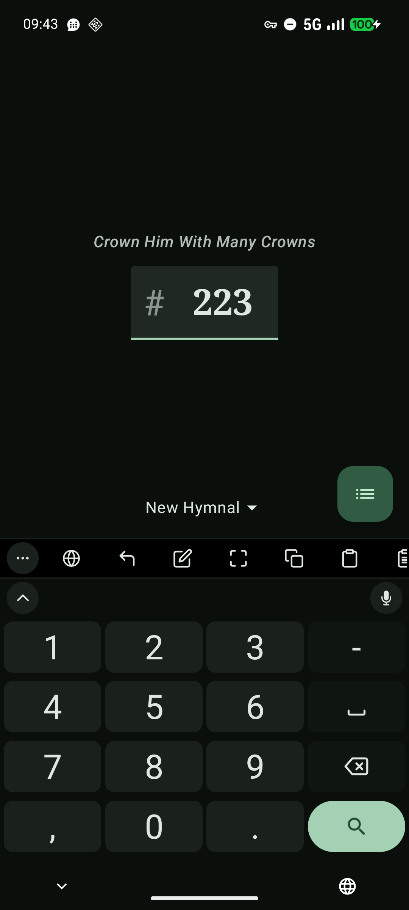
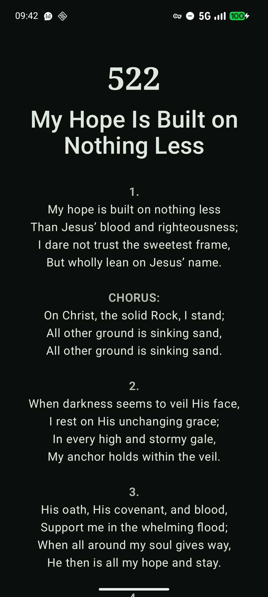

# Adore Hymnal

An Android hymnal app for the Seventh-Day Adventist hymnals. Heavily inspired by [Hymnal-Xamarin](https://github.com/isax5/Hymnal-Xamarin) which is not updated anymore because of a deprecated framework. The hymnal text and sheet music is taken from that project as well.

This app is still in active development.

## Download

Download the app from [GitHub Releases](https://github.com/thebiblelover7/hymnal/releases) or [Google Play](https://play.google.com/store/apps/details?id=org.sda.hymnal). The GitHub and Google Play versions are not interchangeable as they are signed with different keys.

## Contribute
### Issues
If you have any issues, feature suggestions or bugs, please let us know by submitting an issue [here on GitHub](https://github.com/thebiblelover7/hymnal/issues). We'd love to hear from you!

### Translation
To help with translation of the app into various other languages, visit https://hosted.weblate.org/engage/hymnal/ and get started translating to your favorite language. Thanks for your contribution!

## Screenshots

 
